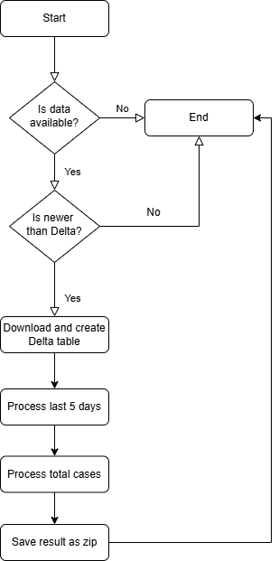

# Covid Data Pipeline

This project ingests European COVID-19 case data from the European Centre for Disease Prevention and Control (ECDC), applies a data model, quality checks, and ETL logic using PySpark and Python. The output consists of a ZIP file containing two CSV files:

1. The latest 5 days of data for all countries.
2. The total number of cases for each country.

## Overview

### Steps in the Data Pipeline
1. Fetch Data Availability: The dataset is fetched from the ECDC website. The availability is checked through an HTTP request.
2. Last Modified Date Check: The modification date of the dataset is checked against the Delta table's stored timestamp to determine whether new data is available for ingestion.
3. Download and Create Delta Table: If new data is available, the CSV file is downloaded and ingested into a Delta table for further processing.
4. Process Data for Last 5 Days: The last 5 days of data are extracted from the dataset and saved to a new Delta table.
5. Process Total Cases Data: The total number of COVID-19 cases for each country is calculated and saved to a separate Delta table.
6. Save Data to CSV and ZIP: Two CSV files are generated:
    - One CSV with the latest 5 days of data for all countries.
    - Another CSV with the total number of cases per country.

    These files are saved into a ZIP archive.

## Testing Strategy

Unit tests are included to validate the data ingestion and processing pipeline. The tests cover key functions like checking data availability, verifying the last modified date, and ensuring proper transformations (e.g., processing the latest 5 days of data, calculating the total cases).

To run the tests:

    pytest tests/test_data_processing.py

## Up-to-date Dataset Strategy

Although the ECDC data is no longer being updated, the pipeline can be adjusted to handle regular updates in the future. If the data were updated twice a week, the following solutions can be proposed:

- Automate the pipeline using Databricks jobs, cron jobs or a cloud scheduler (e.g., AWS Lambda, Azure Functions) to fetch the data every Monday and Thursday.
- Implement incremental loading in the Delta table to minimize resource usage during updates.

## Assumptions

The ECDC dataset is assumed to be available in CSV format with standard fields for country and daily cases.
The Delta table is assumed to be created in a Spark environment (e.g., Databricks).
The date format in the dataset and Delta table history is consistent.
